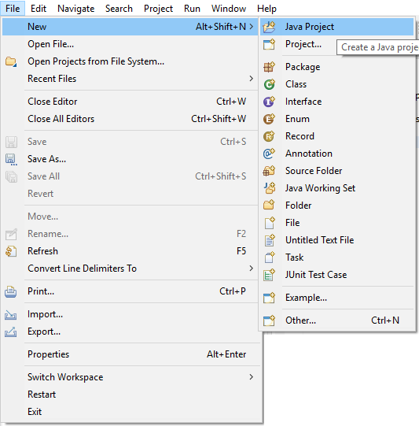

# Hello World

This is a first example for **java** tutorial.

Create new project using Eclipse.

 

Then enter the project name and click finish.

```java
package com.mani;

public class HelloWorld {
	public static void main(String[] args) {
		System.out.println("Hello World!");
	}
}
```