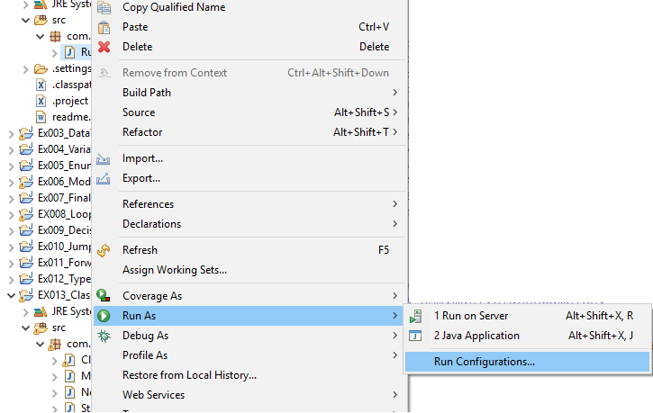
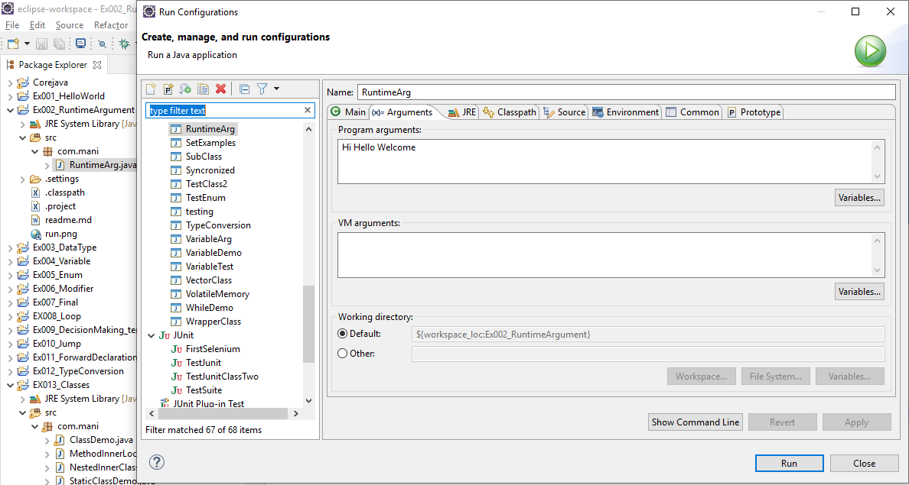

##Runtime Argument
```java
package com.mani;
public class RuntimeArg {
	public static void main(String[] args) {
		System.out.println(args[0]);
		System.out.println(args[1]);
		System.out.println(args[2]);
	}
}
```

##### Setup Run time argument

###### Step 1


 

##### Step 2

 